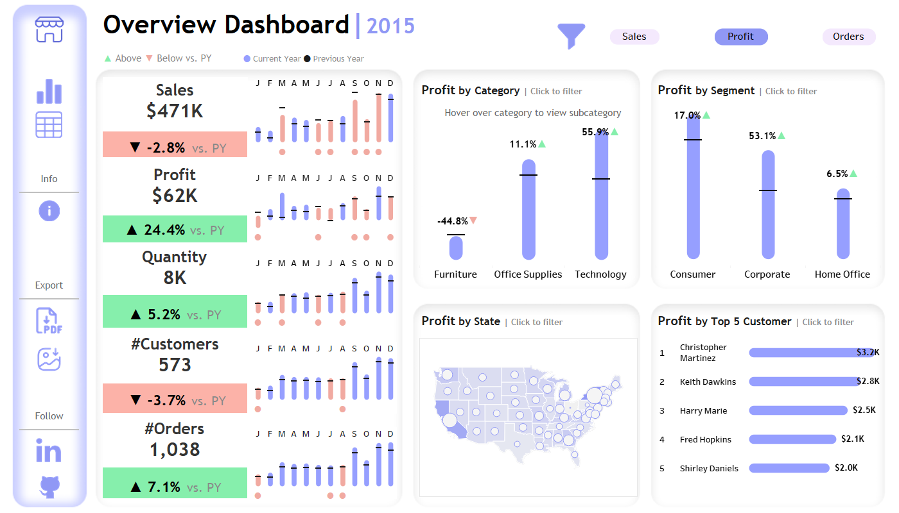
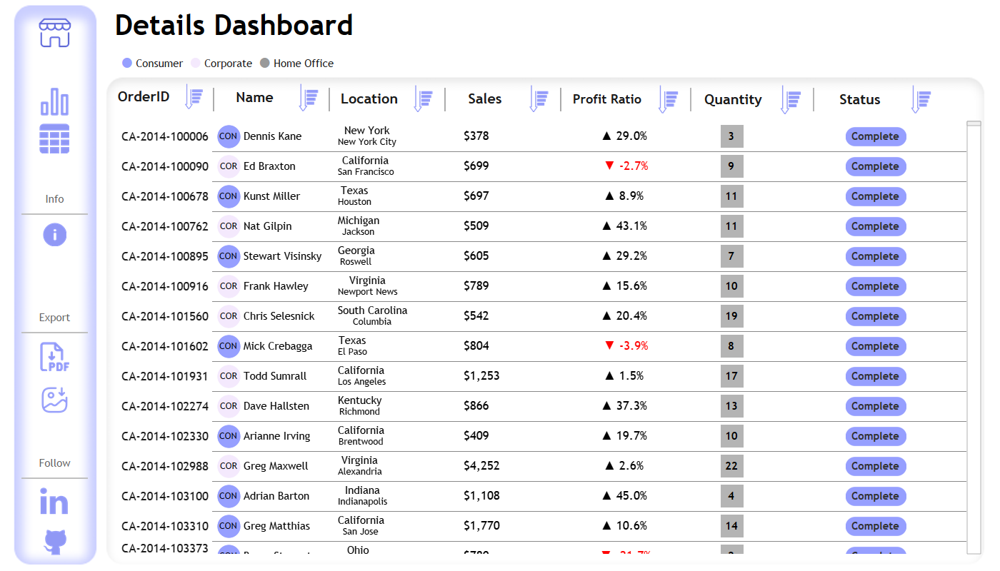

# 📊 Superstore Dashboard (Tableau)

## 🧠 Project Overview

This project presents an interactive, visually appealing, and insight-driven Tableau dashboard built on the **Superstore dataset**. It aims to provide data-driven decisions for **Sales**, **Profit**, **Customer Segmentation**, and **Order Fulfillment**. The project demonstrates key skills in data analytics, storytelling, and Tableau development.

> 🔗 **[Interact with the live Tableau Dashboard here](https://public.tableau.com/views/SuperstoreDashboard_17449892488060/Overview?:language=en-US&:sid=&:redirect=auth&:display_count=n&:origin=viz_share_link)**




---

## 📘 Project Documentation

To explore the full development process, calculations, and step-by-step workflow of this Tableau project, please refer to the Notion documentation:

> 📄 **[Detailed Project Walkthrough on Notion](https://teal-zinnia-075.notion.site/Tableau-Project-1980500fe8288017991ada16eb732a2b?pvs=4)**

---

## 📌 Key Features

### 🧭 Interactive Metric Selector (Sales | Profit | Orders)

Users can switch the primary metric across **four major charts** using a dynamic selector:
- 📍 **By State**  
- 🧱 **By Category**
- 🧑‍💼 **By Segment**
- 👤 **Top N Customers**

This allows users to instantly refocus their analysis from **revenue generation** to **order volume** or **profitability** with a single click.

---

### 🔢 Top N Customers Parameter

Adjustable parameter lets users control the number of **Top Customers** displayed — great for both high-level overviews and deep dives.

---

## 🧮 Technical Highlights

### ➤ Calculated Fields

#### `Max Order Date`
```tableau
DATEADD('month', -6, { FIXED : MAX([Order Date]) })
```
This field calculates a threshold date, 6 months before the latest order date in the dataset. It is used to determine recent or pending orders.

#### `Status`
```tableau
{ FIXED [Order ID] :
  IF MAX([Ship Date]) <= MAX([Max Order Date])
  THEN "Complete"
  ELSE "Pending"
END }
```
This calculation assigns a status to each order based on whether it was shipped before or after the threshold.

---

## 🗂️ Dashboard Components

### 📌 Overview Dashboard

- 🔄 **Dynamic Metric Selector** (Sales | Profit | Orders)
- 📈 **KPI Trends** with Prior Year comparisons
- 🗂️ **Metric by Category, Segment, and State**
- 👥 **Top N Customers** – dynamically adjustable

### 📌 Details Dashboard

- **Order Table**: Order ID, Customer Name, Location, Sales, Profit Margin, Quantity, and Status.
- **Dynamic Sorting & Filtering**: Users can interactively explore the dataset.

---

## 🧰 Tools & Technologies

| Tool        | Purpose                             |
|-------------|-------------------------------------|
| Tableau     | Dashboard design and visual analytics |
| Excel / CSV | Superstore data source              |
| Draw.io     | Container mockup and flowcharts     |
| Figma       | UI/UX planning and background design  |
| GitHub      | Version control and documentation   |
| Notion      | Project workflow documentation      |

---

## 🚀 How to Use

1. Download the repository and open `Tableau Dashboard.twbx` in Tableau Desktop.
2. Connect to the **Superstore dataset**.
3. Explore the interactive dashboards:
   - `Overview Dashboard` for high-level insights.     
   - `Details Dashboard` for in-depth order analysis.

Or simply use the hosted version here:  
🔗 **[Live Dashboard on Tableau Public](https://public.tableau.com/views/SuperstoreDashboard_17449892488060/Overview?:language=en-US&:sid=&:redirect=auth&:display_count=n&:origin=viz_share_link)**

---

## 📈 Use Case Scenarios

- C-level executive performance dashboards
- Regional sales & fulfillment insights
- Profit optimization across segments
- Identifying high-value customers
- Operations performance over time

---

## 🧠 Insights Unlocked

- Technology is the most profitable category.
- Certain customer segments underperform—warranting strategic focus.
- Interactive filters allow instant reanalysis from various business angles.
- The Top N parameter provides targeted customer insight for upselling.

---

## ✍️ Author

**[Ahmed Mohammed Elsayed Mohammed]**  
_Data Analyst | Business Analyst | Tableau Developer_  
🔗 [LinkedIn Profile](https://www.linkedin.com/in/ahmed-mohammed-112637344)  
📊 [Tableau Public Profile](https://public.tableau.com/app/profile/ahmed.mohamed2019)

---

## 📜 License

This project is open source and available under the [MIT License](LICENSE).

---
